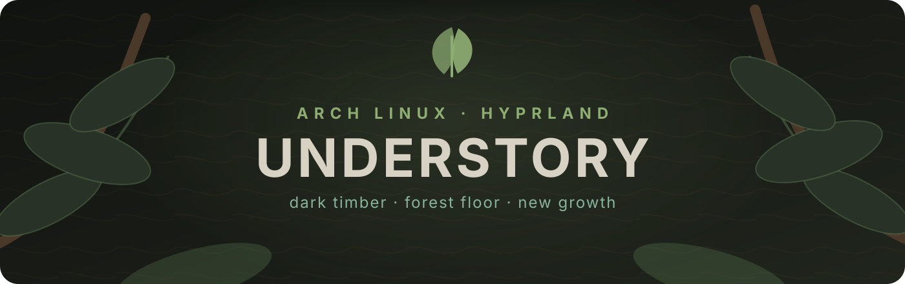
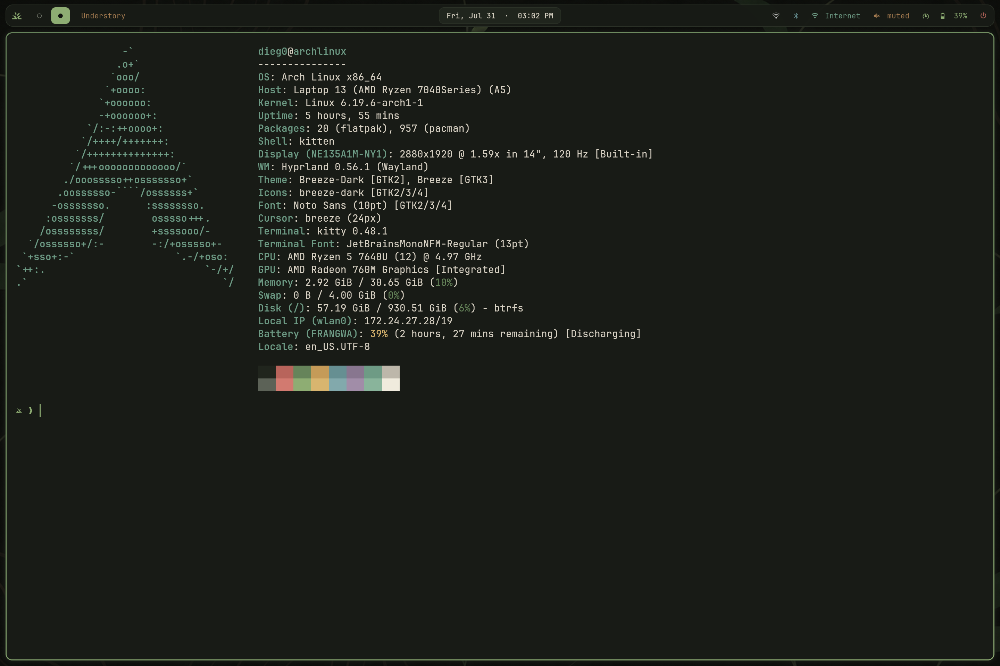
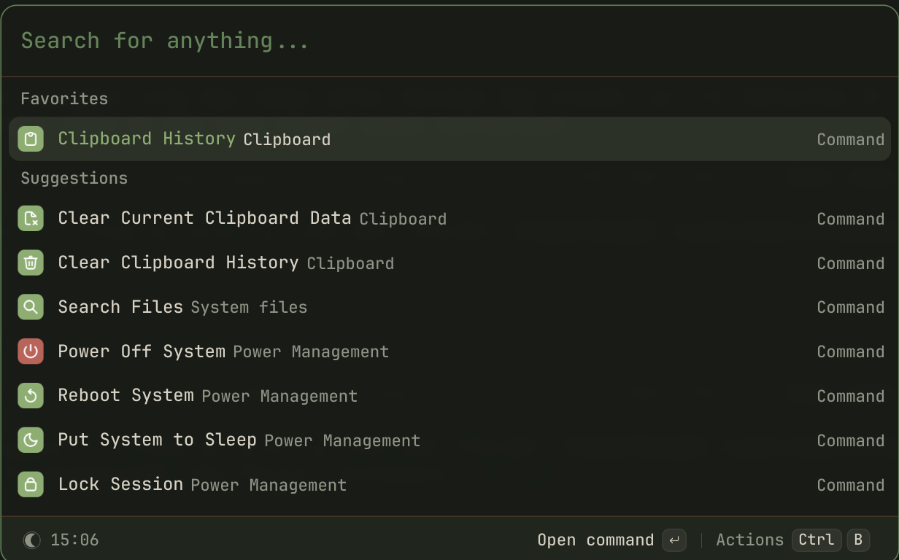
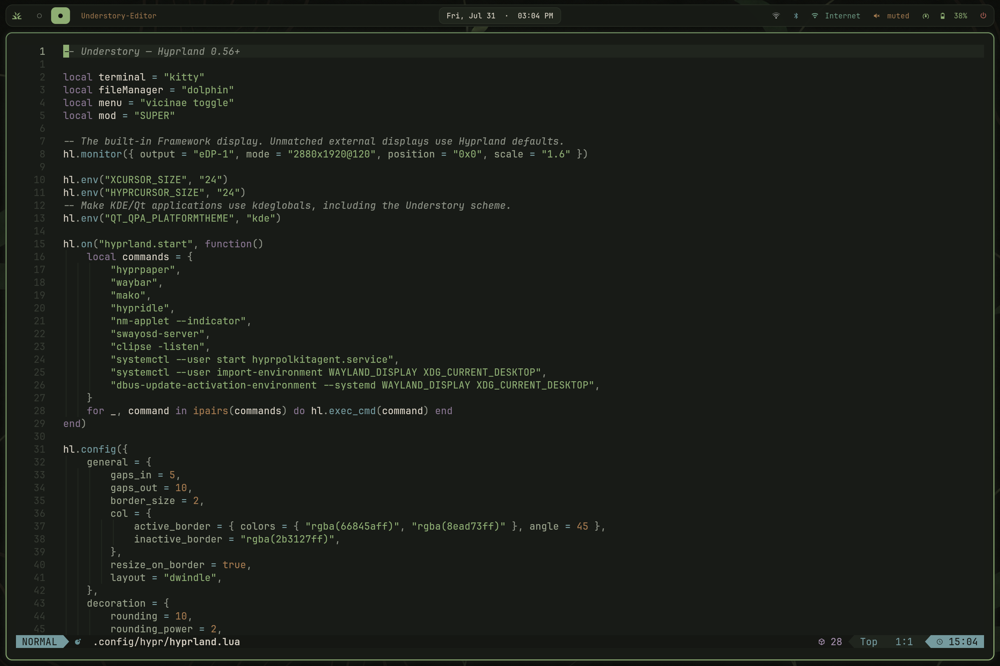

<p align="center">
  
</p>

<p align="center">
  <a href="https://archlinux.org"></a>
  <a href="https://hypr.land"></a>
  <a href="https://www.chezmoi.io"></a>
</p>

<p align="center">
  <strong>A calm, cohesive desktop built for long sessions.</strong><br>
  <sub>One palette from the first unlock to the last terminal.</sub>
</p>



## The rice

Understory is cohesive before it is flashy. Deep forest blacks leave room to
focus; bark browns add warmth; moss and new-growth greens carry state and
motion. The same visual language flows through the compositor, terminal,
launcher, editor, notifications, lock screen, OSD, GTK, and KDE.

The canonical colors and reusable exports live in the standalone
[Understory palette](https://github.com/dieg0net/understory) project.

| Layer | Choice |
| --- | --- |
| Compositor | Hyprland 0.56+ using the modern Lua API |
| Bar | Waybar Git with workspaces, privacy capture, media, power, and Mako state |
| Launcher | Vicinae |
| Terminal | Kitty + JetBrainsMono Nerd Font |
| Shell | Bash + Starship |
| Editor | LazyVim / Neovim |
| Notifications | Mako |
| OSD | SwayOSD |
| Files | Dolphin + Gwenview + Okular |
| Clipboard | Clipse |
| Dotfiles | Chezmoi |

<table>
  <tr>
    <td width="50%"></td>
    <td width="50%"></td>
  </tr>
  <tr>
    <td align="center"><sub>Vicinae command palette</sub></td>
    <td align="center"><sub>LazyVim with the shared palette</sub></td>
  </tr>
</table>

## Beneath the canopy

| Gesture | What grows from it |
| --- | --- |
| `Super + D` | Open the Vicinae command palette |
| `Super + V` | Search text and image clipboard history |
| `Super + Shift + S` | Select an area and copy it without creating a file |
| Volume click / middle / right | Mixer / mute / choose an output |
| Bell click / middle / right | Restore / do not disturb / clear notifications |

The bar exposes microphone and screen capture only while active. Idle behavior
dims, locks, powers off the panel, and suspends only on battery. The wallpaper
and every color-bearing configuration are included—there are no missing theme
pieces hidden outside the repository.

## Grow your own

> [!IMPORTANT]
> This is an opinionated post-install for Arch Linux, not an unattended OS
> installer. Read the script before running it and start from a working user
> account with `sudo` access.

```bash
git clone https://github.com/dieg0net/dotfiles-arch.git
cd dotfiles-arch
less install.sh
./install.sh --category desktop --category audio
```

For only the managed files on an already configured system:

```bash
chezmoi init --apply dieg0net
```

Preview the installer without changing anything:

```bash
./install.sh --dry-run --category desktop --category audio --non-interactive
```

The installer remains category-driven, so development, creator, gaming,
virtualization, and security tools stay optional. Run `./install.sh
--list-categories` for the complete catalog. The original pre-Understory
installer is preserved at `scripts/glow-up-arch.sh`.

<details>
<summary><strong>Explore the repository layout</strong></summary>

<br>

```text
dot_config/              application configuration managed by Chezmoi
dot_local/bin/           small desktop helpers
Pictures/Wallpapers/     the Understory wallpaper
assets/screenshots/      repository showcase images
install.sh               interactive Arch post-install
packages.txt             concise package reference
```

The Framework Laptop display declaration is near the top of
`dot_config/hypr/hyprland.lua`; change the output, resolution, refresh rate, or
scale for another machine.

</details>

## Forest floor

| Role | Hex |
| --- | --- |
| Forest black | `#181B16` |
| Bark surface | `#20251D` |
| Moss | `#66845A` |
| New growth | `#8EAD73` |
| Dark wood | `#4A3829` |
| Warm wood | `#A47B50` |
| Linen | `#D8D2C4` |

<p align="center">
  
  
  
  
  
</p>

The palette is also available as a standalone theme foundation in
[`dieg0net/understory`](https://github.com/dieg0net/understory).

## Privacy

Browser profiles, GitHub authentication, clipboard contents, shell history,
cookies, application databases, and caches are deliberately excluded. The
repository contains configuration—not personal state.
