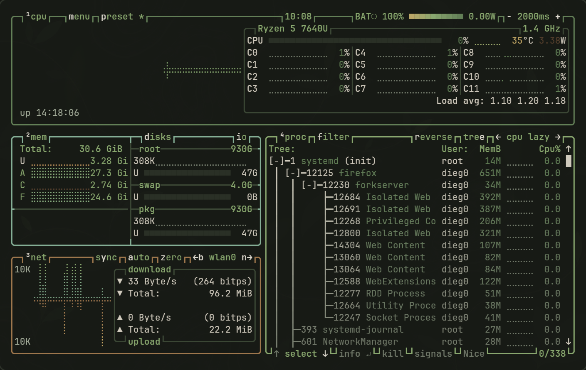

<p align="center">
  
</p>

<p align="center">
  <a href="https://archlinux.org"></a>
  <a href="https://hypr.land"></a>
  <a href="https://www.chezmoi.io"></a>
</p>

<p align="center">
  <strong>A modern Arch desktop styled with Understory.</strong>
  <br>
  <sub>My everyday Arch setup for work, life, late-night games, and whatever the day throws at me.</sub>
</p>

<p align="center">
  <a href="#showcase">Showcase</a> ·
  <a href="#the-desktop">Desktop</a> ·
  <a href="#below-the-canopy">Keybinds</a> ·
  <a href="#grow-your-own">Install</a> ·
  <a href="#jungle-floor">Palette</a>
</p>


## Showcase

<table>
  <tr>
    <td width="50%">
      <a href="assets/screenshots/desktop.png"></a>
    </td>
    <td width="50%">
      <a href="assets/screenshots/launcher.png"></a>
    </td>
  </tr>
  <tr>
    <td align="center"><sub><strong>01 · Desktop</strong><br>Hyprland, Waybar, and the canopy</sub></td>
    <td align="center"><sub><strong>02 · Launch</strong><br>Vicinae command palette</sub></td>
  </tr>
  <tr>
    <td width="50%">
      <a href="assets/screenshots/editor.png"></a>
    </td>
    <td width="50%">
      <a href="assets/screenshots/system-monitor.png"></a>
    </td>
  </tr>
  <tr>
    <td align="center"><sub><strong>03 · Create</strong><br>LazyVim development workspace</sub></td>
    <td align="center"><sub><strong>04 · Observe</strong><br>Kitty and a custom btop theme</sub></td>
  </tr>
</table>

<p align="center"><sub>Open any frame for the full-resolution screenshot.</sub></p>

## The desktop

This setup is cohesive and expressive in equal measure. The Understory theme
ties it together with jungle-shadow blacks, dark hardwood warmth, and fern and
climbing-vine greens that carry state and motion. That visual language flows
through the compositor, terminal, launcher, editor, notifications, lock screen,
OSD, GTK, and KDE.

The canonical colors and reusable exports live in the standalone
[Understory palette](https://github.com/dieg0net/understory) project.

| Layer | Choice |
| --- | --- |
| Compositor | Hyprland 0.56+ using the modern Lua API |
| Bar | Waybar Git with workspaces, privacy capture, media, power, and Mako state |
| Launcher | Vicinae |
| Terminal | Kitty + JetBrainsMono Nerd Font |
| Shell | Bash + Starship |
| Monitor | btop with a custom Understory theme |
| Editor | LazyVim / Neovim |
| Notifications | Mako |
| OSD | SwayOSD |
| Files | Dolphin + imv + Gwenview + Okular |
| Clipboard | Clipse |
| Dotfiles | Chezmoi |

### What makes it feel alive

- **One visual language.** Understory colors flow through native UI, terminal
  tools, the editor, launcher, notifications, lock screen, and OSD.
- **Useful motion.** Workspace transitions, live states, capture indicators,
  and media controls communicate without turning the desktop noisy.
- **Laptop-aware.** Battery warnings, idle dimming, suspend behavior, touchpad
  gestures, brightness feedback, and output switching are already wired in.
- **Fast everywhere.** Vicinae, Clipse, Starship, LazyVim, and btop keep common
  actions within a keystroke while staying visually consistent.

## Below the canopy

| Gesture | What grows from it |
| --- | --- |
| `Super + D` | Open the Vicinae command palette |
| `Super + V` | Search text and image clipboard history |
| `Super + Shift + S` | Select an area and copy it without creating a file |
| `Super + Return` | Open Kitty |
| `Super + E` | Open Dolphin |
| `Super + L` | Lock the session |
| Volume click / middle / right | Mixer / mute / choose an output |
| Bell click / middle / right | Restore / do not disturb / clear notifications |

The bar exposes microphone and screen capture only while active. Idle behavior
dims, locks, powers off the panel, and suspends only on battery. The wallpaper
and every color-bearing configuration are included—there are no missing theme
pieces hidden outside the repository.

## Grow your own

> [!IMPORTANT]
> This is an opinionated post-install for Arch Linux, not an unattended OS
> installer. Read the script before running it and start from a working user
> account with `sudo` access.

```bash
git clone https://github.com/dieg0net/dotfiles-arch.git
cd dotfiles-arch
less install.sh
./install.sh --category desktop --category audio
```

For only the managed files on an already configured system:

```bash
chezmoi init --apply dieg0net
```

Preview the installer without changing anything:

```bash
./install.sh --dry-run --category desktop --category audio --non-interactive
```

The installer remains category-driven, so development, creator, gaming,
virtualization, and security tools stay optional. Run `./install.sh
--list-categories` for the complete catalog. The original pre-rice
installer is preserved at `scripts/glow-up-arch.sh`.

<details>
<summary><strong>Explore the repository layout</strong></summary>

<br>

```text
dot_config/              application configuration managed by Chezmoi
dot_local/bin/           small desktop helpers
Pictures/Wallpapers/     the Understory wallpaper
assets/screenshots/      repository showcase images
install.sh               interactive Arch post-install
packages.txt             concise package reference
```

The Framework Laptop display declaration is near the top of
`dot_config/hypr/hyprland.lua`; change the output, resolution, refresh rate, or
scale for another machine.

</details>

## Jungle floor

| Role | Hex |
| --- | --- |
| Canopy shadow | `#181B16` |
| Bark surface | `#20251D` |
| Jungle moss | `#66845A` |
| Climbing green | `#8EAD73` |
| Dark hardwood | `#4A3829` |
| Sun-warmed wood | `#A47B50` |
| Linen | `#D8D2C4` |

<p align="center">
  
  
  
  
  
</p>

The palette is also available as a standalone theme foundation in
[`dieg0net/understory`](https://github.com/dieg0net/understory).

## Privacy

Browser profiles, GitHub authentication, clipboard contents, shell history,
cookies, application databases, and caches are deliberately excluded. The
repository contains configuration—not personal state.
